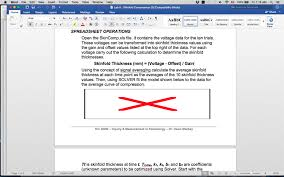

```{r setup, include=FALSE}
knitr::opts_chunk$set(echo = FALSE)
```

## O que queremos fazer? {.flexbox .vcenter}

Apresentar uma forma de o produtor de conteúdo conseguir escalar a sua capacidade 
de produção, sem perda de precisão ou acurácia e com ganho de segurança.


## Outline

Nesta palestra, vamos apresentar 

- a forma "tradicional" de produzir conteúdo
- um conjunto de princípios, boas práticas e recursos computacionais 
    - alguns mais e outros menos manjados quando considerados separadamente, 
      **mas** que
    - não são usados conjuntamente com a frequência e a orientação que mereciam
- uma forma de utilizar os itens acima para trabalhar de forma melhor que a 
  "tradicional"
- com isso, esta palestra pode ficar trivial para alguns e útil para outros


## Quais princípios?

Princípios que consideraremos

- Programação Literária (*Literate Programming*), 
- Reprodutibilidade de Pesquisa (*Reproducible Research*)


## Quais boas práticas?

Boas práticas de programação que consideraremos

- "Código é documentação"
- "Use sistema de controle de versão"
- "Confie à programação os processos repetitivos"
- "Reaproveite código que funciona"

## Quais ferramentas de computação?

Ferramentas que utilizaremos para ilustrar uma aplicação *aqui nesta apresentação*

- Linguagem de Programação *R*
- Linguagem de Marcação *Markdown* 
- Formato de Arquivo e Interface *R Markdown*
- Ambiente de Desenvolvimento Integrado (IDE) *RStudio*
- Sistema de interface programável de aplicativo *API*
- Sistema JupiterWeb acessíveis através de sistema de API
    - porém usando só funcionalidades não exijam autenticação

---

<font size=6>

**Ferramentas que também poderíamos considerar pelo mesmo custo mental se você já as dominar, mas que não daria tempo nem espaço de abordarmos porque já fomos insanamente ambiciosos de enfiar um monte de coisas na apresentação**

</font>

<font size=4>

Por questão de brevidade, não vamos usar nesta apresentação, mas poderíamos ter 
usado também 

- as linguagens de programação *Python* e *SQL*
    - junto com o *Python*, vêm os programas acessíveis via biblioteca *Python*
        - manipulação de imagem, IoT, NLP, raspberry pi, ARCGIS
- o sistema de preparação de documentos *LaTeX*
- o pacote *Shiny* para montar web apps e dashboards
- outras fontes de dados acessíveis/raspáveis através de sistema de API
    - e.g., os sistemas *G Suite*, Facebook, Twitter, Instagram, Telegram, 
      WhatsApp
        - todos esses exigem autenticação, que pode ser realizada com o pacote 
          `auth0`, que foi apresentado pelo Júlio Trecenti hoje mais cedo

</font>

## Abordagem "tradicional"

- geração das diferentes partes do conteúdo em softwares diferentes
    - texto
    - imagens
    - tabelas
    - etc.
- junção manual através do recurso de cópia e colagem do editor de texto
    - geralmente MS-Word ou Google Docs


## Abordagem "tradicional"

- vantagens
    - rápido de aprender
    - rápido de fazer
- desvantagens
    - perda da origem das partes do conteúdo
    - perda do *como* as partes foram feitas
    - se uma das imagens ou tabelas não for mais reconhecida internamente
        - no MS-Word, se não houver uma cópia em disco junto com o .doc/.docx 
        - no Google Docs, se não houver uma cópia no Google Drive
        - então já era: o grande X vermelho from hell!

## Então Já Era! {.flexbox .vcenter}

O grande X vermelho from hell!



# Princípios, Boas Práticas e Ferramentas

# Princípios

## Programação Literária | *Literate Programming*

"Literate programming is a programming paradigm introduced by Donald Knuth in 
which a computer program is given an explanation of its logic in a natural 
language, such as English, interspersed with snippets of macros and traditional 
source code, from which compilable source code can be generated."

- Fonte: [Wikipedia](https://en.wikipedia.org/wiki/Literate_programming) \ \ \  
  `r emo::ji("laughing")`
- Donald Knuth == inventor do TeX e do LaTeX
- documento == descrição do documento + pedaços de texto + pedaços de código
- <font size=1>Caveat emptor: Não faça citações à Wikipedia no seu trabalho de
faculdade, monografia, disertação ou tese!  Apesar de muitas páginas terem
informação tecnicamente muito acurada, ainda assim há páginas muito ruins e
imprecisas.  Se o leitor não souber diferenciar, pode levar gato por lebre fácil
fácil.  Aqui (i) eu estou fazendo de zueira para uma apresentação, (ii) eu já
conheço as definições, sabia avaliar se a definição deles estava OK e só estava
com preguiça de redigir com meus próprios termos.</font>


## Programação Literária | *Literate Programming*

"Literate programming (LP) tools are used to obtain two representations from a 
literate source file: one suitable for further compilation or execution by a 
computer, the 'tangled' code, and another for viewing as formatted documentation, 
which is said to be 'woven' from the literate source."

- Fonte: [Wikipedia](https://en.wikipedia.org/wiki/Literate_programming) \ \ \  
  `r emo::ji("laughing")`
- moral da história: não redija o documento, mas sim o meta-documento que gerará 
  o documento


## Programação Literária | *Literate Programming*

"A traditional computer program consists of a text file containing program code. 
Scattered in amongst the program code are comments which describe the various 
parts of the code. In literate programming the emphasis is reversed. Instead of 
writing code containing documentation, the literate programmer writes 
documentation containing code."

- Ross Williams. FunnelWeb Tutorial Manual, pg 4.
    - apud. <http://www.literateprogramming.com/>

## Reprodutibilidade de Pesquisa | *Reproducible Research*

"The term *reproducible research* refers to the idea that the ultimate product 
of academic research is the paper along with the laboratory notebooks and full 
computational environment used to produce the results in the paper such as the 
code, data, etc. that can be used to reproduce the results and create new work 
based on the research."

- Fonte: 
  [Wikipedia](https://en.wikipedia.org/wiki/Reproducibility#Reproducible_research) 
  \ \ \  
  `r emo::ji("laughing")`
- "documentos" autocontidos: jupyter notebooks, git projects de R Markdown
- a CRAN Task View de Reprodutibilidade de Pesquisa: 
  <https://cran.r-project.org/view=ReproducibleResearch>


# Boas práticas

## "Código é documentação"

- o código que gerou a imagem ou tabela *já é* documentação
    - de onde vieram os dados, 
    - como foi calculado, 
    - quais opções de visualização foram usadas no gráfico ou tabela
- o código que buscou a informação online *já é* documentação
    - de onde os dados foram coletados/raspados/requeridos, 
    - como foi processado
    - quais opções de visualização foram usadas


## "Use sistema de controle de versão"

- "*Use sistema de controle de versão*" é o "*Use protetor solar*" dos programadores
- sistema de controle de versão (VCS == version control system)
- "Version control is a system that records changes to a file or set of files 
  over time so that you can recall specific versions later."
- "In a DVCS (such as Git, Mercurial, Bazaar or Darcs), clients don’t just check 
  out the latest snapshot of the files; rather, they fully mirror the repository, 
  including its full history."

## "Use sistema de controle de versão"

- permite rastrear a versão documento
    - sabe o "*putz, não podiam ter jogado fora aquele gráfico*" e o 
      "*é, ninguém mais consegue achar o arquivo de imagem e nem cópia da versão anterior*"?
    - pois é, isso não acontece com um sistema de controle de versão
    - é possível dar um *rollback* pra qualquer versão de interesse
- bônus: permite redação colaborativa (não simultânea) do documento
    - Google Docs também permite redação colaborativa, só que simultânea
- bônus: permite documentar quais alterações foram feitas e por quem

## "Use sistema de controle de versão"

- um exemplo de SVC é o *git*, 
    - sistema de controle *distribuido* de versão
        - *commit* no seu repositório local
        - *pull* e *push* para sincronização com o repositórios remoto
    - saiba mais em 
        - <https://git-scm.com/video/what-is-version-control>
        - <https://git-scm.com/video/what-is-git>
        - <https://git-scm.com/book/en/v2>


## "Confie à programação os processos repetitivos"

- não use o *loop* copie-cole-altere-copie-cole-altere-...
    - você ***vai*** errar em algum ponto
    - se você precisar refazer, vai errar em *outro* ponto, de modo que
      nunca vai ficar igual à primeira versão
- use um *chunk* que obtenha, processe e formate os dados


## "Reaproveite código que funciona"

- o *chunk* que funciona em um documento pode servir de início e ser adaptado para 
  uma finalidade próxima em outro documento


# Ferramentas

## A linguagem de programação *R* {.flexbox .vcenter}


<font size=1>
Imagem chupinhada desavergonhadamente de 
<https://blog.revolutionanalytics.com/2010/11/acm-data-mining-camp-1.html>
</font>


## Linguagem de Marcação *Markdown* 

- uma linguagem de marcação desvincula conteúdo e forma do texto
    - ao invés de formatar diretamente o texto e ficar com uma imagem da versão 
      final do texto, você escreve o seu conteúdo sem se preocupar com formatação 
      e aí, só no fim, você gera uma versão formatada do texto
- a linguagem *Markdown* é processada pelo aplicativo *pandoc*, que implementa 
  programação literária

## Linguagem de Marcação *Markdown* 

- o *Markdown* permite incluir no documento
    - texto
    - imagens
    - tabelas
    - pedaços de código (*chunks*) de várias linguagens
- o *pandoc* consegue gerar saídas em
    - .pdf (texto ou *slides*)
    - .html (texto, *slides* ou *dashboard*)
    - .ppt/.pptx
    - .doc/.docx
- <font size=1>*markdown* é um trocadilho com *markup*, como em 
  *hyper text markup language* (`html`)</font>


## Formato de Arquivo e Interface *R Markdown*

## Ambiente de Desenvolvimento Integrado (IDE) *RStudio*


## Sistema de Interface Programável de Aplicativo *API*

## Sistema JupiterWeb acessíveis através de sistema de *API*


---


- dados na internet
    - páginas estáticas
    - páginas dinâmicas
        - geradas por API
            - url de uma página gerada por API
            


            
pegar a imagem de:
- <https://uspdigital.usp.br/jupiterweb/jupDisciplinaBusca?tipo=D>

analisar a sintaxe de
- <https://uspdigital.usp.br/jupiterweb/obterDisciplina?nomdis=&sgldis=ACH0021>
- <https://uspdigital.usp.br/jupiterweb/listarGradeCurricular?codcg=86&codcur=86450&codhab=202&tipo=N>


acessíveis via API

- técnicas de coleta/raspagem/requisição de dados
    - uso de API pra pedir e obter dados em forma JSON ou XML
        - packages 
    - uso de pacotes 
- interface com sistemas cloud
    - até tem o sistema de API, mas alguns packages encapsulam a sintaxe,pra 
      facilitar a vida
- reaproveitamento de código em outras circunstâncias
  


- reproducible research
- reproducible documents
- <https://kbroman.org/datacarpentry_R_2018-06-04/04-rmarkdown.html>
- litterate programming
- <https://andrewbtran.github.io/NICAR/2017/reproducibility-rmarkdown/rmarkdown.html>


- programação literária (*literate programming*; mistura de texto e código), 
- reprodutibilidade de pesquisa 
  (*reproducible research*; )


