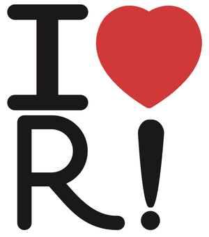
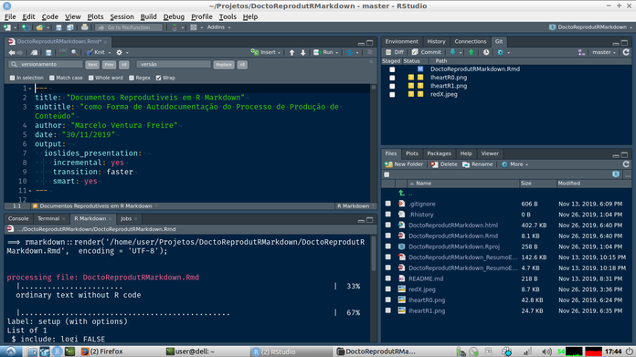
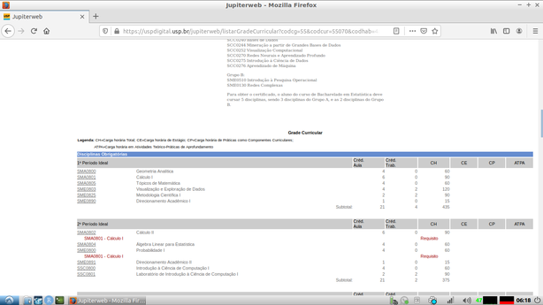
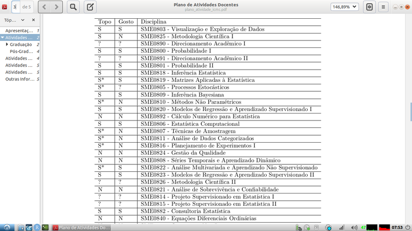

## Primeiramente

Obrigado aos organizadores do evento

Obrigado à plateia presente


## O que quero fazer? {.flexbox .vcenter}

Vou apresentar uma possibilidade de você, produtor de conteúdo, conseguir escalar 
a sua capacidade de produção, com ganho de segurança e sem perda de precisão ou 
acurácia.

Vou falar menos sobre *R*, *R Markdown* e *R Studio* e mais sobre outros tópicos 
que propiciam uma exploração melhor dos recursos desses primeiros.


## Outline

Vou apresentar 

- um conjunto de princípios, boas práticas de programação e ferramentas de 
  computação que potencializam o uso do R Markdown no RStudio
    - alguns desses mais manjados, outros menos, quando considerados em separado
    - contudo que podem ser mais e melhor usados em conjunto


## Princípios

- Programação Literária (*Literate Programming*)
- Reprodutibilidade de Pesquisa (*Reproducible Research*)


## Boas Práticas de Programação

Caracterizadas pelos aforismos

- "Código é documentação"
- "Confie à programação os processos repetitivos"
- "Reaproveite código que já funciona"
- "Use sistema de controle de versão"


## Ferramentas de Computação

Eu usei para criar um exemplo de aplicação para esta apresentação de hoje

- Linguagem de Programação *R*
- IDE *RStudio*
- Linguagem de Marcação *Markdown* 
- Formato de Arquivo *R Markdown*
- Aplicativo *Pandoc*
- Sistema de Interface de Programação de Aplicações *API*
- Sistema JupiterWeb, da USP
    - que é acessível através de sistema de API
    - porém só vou usar funcionalidades não exijam autenticação

... mas ...


---

<font size=6>

**Ferramentas e recursos que também poderiam ser consideradas pelo mesmo custo mental se você já as dominar, mas que não daria tempo nem espaço de eu abordar aqui nestes 15 min porque já fui insanamente ambicioso de enfiar um monte de coisas na apresentação**

</font>

<font size=4>

- as linguagens de programação *Python* e *SQL*
    - junto com o *Python*, vêm todos os programas acessíveis via biblioteca *Python*
        - manipulação de imagem, IoT, NLP, Raspberry Pi, ARCGIS etc.
    - <<< Quantas e quais outras linguagens posso usar nos chunks? 
      Rode \ `names(knitr::knit_engines$get())` no seu R procê vê
- o sistema  *LaTeX* >>> de preparação de documentos
- o pacote *Shiny* >>> para montar *web apps* e *dashboards*
- outras fontes de dados acessíveis via sistemas *RESTful API* ou raspáveis de 
  forma mais geral >>>
    - <<< *G Suite*, Facebook, Twitter, Instagram, Telegram, WhatsApp
    - <<< Open Data: 
      [World Bank Open Data](https://data.worldbank.org/),
      [World Health Organization Open data repository](https://www.who.int/gho/database/en/),
      [Google Public Data Explorer](https://www.google.com/publicdata/directory),
      [Registry of Open Data on AWS](https://registry.opendata.aws/)
      entre outros

</font>


## Na Abordagem "Tradicional"

- Geração das diferentes partes do conteúdo em diferentes softwares
    - texto, >>> no Word ou Google Docs
    - slides, >>> no PowerPoint ou no Google Slides
    - imagens, >>> no PhotoShop ou Gimp ou similares
    - gráficos e tabelas, >>> no Excel ou no Google Sheets
    - etc.
- junção manual através do recurso de cópia e colagem no editor de texto >>> ou 
  slides
    - <<< geralmente no Word, Google Docs, PowerPoint ou Google Slides


## Abordagem "tradicional"

- vantagens
    - rápido de aprender
    - rápido de fazer
- desvantagens
    - perda da origem das partes do conteúdo
    - perda do *como* as partes foram feitas
    - problemas 
        - se imagens ou tabelas não forem mais reconhecida internamente e 
        - se não houver o arquivo original para substituir o objeto
        - então já era: o grande X vermelho from hell!


## <<< Então Já Era! {.flexbox .vcenter}

O grande X vermelho from hell!


# > Princípios, Boas Práticas e Ferramentas


# > Princípios


## Programação Literária | *Literate Programming*

<font size=4>

"Um programa de computador tradicional consiste em um arquivo de texto contendo 
o código do programa.  Espalhados no código do programa, há comentários que 
descrevem as várias partes do código. Na programação literária, a ênfase é 
invertida. Ao invés de escrever código contendo documentação, o programador 
literário escreve documentação que contém o código." --- 
[Ross Williams](http://www.literateprogramming.com/)

No contexto da produção de conteúdo,

- documento == mar de texto + ilhas de código
- na verdade, você redige um *metadocumento*, parte texto e parte código, 
  processados por programas diferentes cujas saídas são combinadas para gerar a 
  visão final do documento
    - metadocumento == código fonte 
    - visão final do documento == código objeto
    - geração da visão final == compilação
- moral da história: não redija o documento, mas sim o metadocumento que gerará 
  o documento

</font>


## Reprodutibilidade de Pesquisa | *Reproducible Research*

"O termo *pesquisa reprodutível* refere-se à idéia de que o produto final da 
pesquisa acadêmica é o artigo juntamente com cadernos de laboratório e ambiente 
computacional completo usados para produzir os resultados no artigo, como código, 
dados, etc. a serem usados para reproduzir os resultados e para criar novos 
trabalhos com base na pesquisa."
<font size=1>
\ <<< Fonte: 
  [Wikipedia](https://en.wikipedia.org/wiki/Reproducibility#Reproducible_research) 
  \ \ \  
  `r emo::ji("laughing")`
</font>

Transportando para a realidade da produção de conteúdo

- o produto final passa a ser o projeto inteiro que gerou o documento, incluíndo 
  o documento final, o metadocumento, imagens, microdados etc.
    - "documentos" autocontidos: jupyter notebooks, projetos de R Markdown com os 
      microdados, imagens e tabelas


# > Boas práticas


## "Código é documentação"

- o código que gerou a imagem ou tabela *já é* documentação
    - de onde vieram os dados, 
    - como foi calculado, 
    - quais opções de visualização foram usadas no gráfico ou tabela
- o código que buscou a informação online *já é* documentação
    - de onde os dados foram coletados/raspados/requeridos, 
    - como foi processado
    - quais opções de visualização foram usadas


## "Confie à programação os processos repetitivos"

- não use o *loop* manual copie-cole-altere-copie-cole-altere-...
    - você ***vai*** errar em algum ponto
    - se você precisar refazer, vai errar em *outro* ponto, de modo que nunca 
      vai ficar igual à primeira versão
- ao invés disso, use um *chunk* para obter, processar e formatar os dados


## "Reaproveite código que já funciona"

- Um *chunk* que funciona em um documento pode ser adaptado para uma finalidade 
  próxima em outro documento
    - melhor do que começar do zero, principalmente de for um programa 
      potencialmente trabalhoso
- essa boa prática não pode ser seguir se você não usa *chunks*, como ocorre no 
  Word e no Google Docs


## "Use sistema de controle de versão"

- É o "*Use protetor solar*" dos programadores
- Sistema de Controle de Versão (SCV) é um sistema que registra as mudanças 
  cumulativas do conjunto de arquivos que compõem o projeto, de modo que seja 
  possível encontrar o estado corrente do projeto em qualquer momento do seu 
  desenvolvimento que se deseje
    - Um exemplo de SVC é o [*git*](https://git-scm.com/), utilizado pelo RStudio
- um SCV permite rastrear qualquer documento
    - sabe o "*putz, não podiam ter jogado fora aquele gráfico*" 
      <!-- e o "*é, ninguém tá achando a versão anterior da arquivo*" -->
      ?
    - isso não acontece se você usar um sistema de controle de versão, pois é 
      possível dar um *rollback* pra qualquer versão de interesse e achar o 
      arquivo


<!-- ## Sistema de Controle de Versão | Partes de um SCV -->

<!-- - diretório do seu projeto -->
<!--     - arquivos que você edita, a terem suas versões monitoradas -->
<!--     - podem ser seus programas, imagem, dados etc. -->
<!-- - repositório -->
<!--     - um segundo diretório, onde o SCV vai guardar as mudanças ocorridas no  -->
<!--       diretório do seu projeto -->
<!--     - frequentemente, armazendado *dentro* do diretório do projeto como um  -->
<!--       diretório oculto que não será monitorado (para evitar recursão infinita) -->


## Sistema de Controle de Versão | O que um SCV faz?

Se der tempo, eu volto neste slide

- *commit* -- detecta e armazena no repositório as mudanças nos arquivos do projeto
- *branch* -- cria ramos independentes e intercomunicáveis de edição do projeto
- *merge* -- mescla ramos intercomunicáveis
- *push* -- faz o repositório remoto ficar igual ao repositório local
- *pull* -- faz o repositório local ficar igual ao repositório remoto
- *clone* -- cria repositório local que é cópia de um repositório remoto
- *fork* -- cria repositório remoto que é cópia de um outro repositório remoto


<!-- ## Sistema de Controle de Versão | O que um SCV faz? *Commit* -->

<!-- - *commit* -->
<!--     - detecta arquivos novo ou arquivo removido do diretório do projeto -->
<!--     - detecta alterações nos arquivos em relação à última versão do projeto  -->
<!--       armazenada no repositório (*diff*) -->
<!--         - inclusão, exclusão e alteração de linhas -->
<!--             - alteração == exclusão + inclusão -->
<!--     - cria no repositório as novas alterações, detectadas acima -->
<!--     - atualiza a última versão dos arquivos, para o próximo *commit* -->
<!--     - registra o ou os *commit* anterior e anexa uma assinatura no *commit* atual -->
<!--     - ele faz isso sempre, sem esquecer ou pular -- ao contrário de você, seu  -->
<!--       humano falível e destraído! \ \ `r emo::ji("robot")` -->


<!-- ## Sistema de Controle de Versão | O que um SCV faz? *Branch* -->

<!-- Você pode precisar criar versões diferentes do mesmo projeto (e.g., versões *dev*  -->
<!-- e *produção* do modelos, ou apresentações nas versões *para o setor Financeiro* e  -->
<!-- *para o setor Vendas*), mas precisa manter intercomunicabilidade entre os projetos -->

<!-- - *branch* -->
<!--     - a partir de um mesmo *commit*, você pode começar a editar versões  -->
<!--       progressivamente diferentes do projeto, criando ramos (*branches*)  -->
<!--       diferentes do mesmo projeto -->
<!--     - um SCV permite cambiar entre e continuar trabalhando nos diferentes *branches* -->


<!-- ## Sistema de Controle de Versão | O que um SCV faz? *Merge* -->

<!-- Um SCV consegue administrar um sistema de mesclas (*merging*) entre *branches* -->

<!-- - *merge* -->
<!--     - cria um *commit* com a junção do último *commit* de cada *branch* -->
<!--         - esse *commit* tem a assinatura dos dois *commits* que o geraram -->
<!--     - se houver conflitos ou colisões entre os dois commits, -->
<!--         - o usuário resolve manualmente o conflito/colisão e -->
<!--         - gera outro *commit* -->


<!-- ## Sistema de Controle de Versão | O que um SCV distribuído faz? *Pull* e *push* -->

<!-- Em um SCV *distribuído*, é possível criar um repositório remoto (em outra máquina) -->
<!-- a ser sincronizado com o repositório local.  Nesse caso, é possível que varias  -->
<!-- pessoas editem o mesmo projeto, consolidando as modificações de todos no  -->
<!-- repositório remoto -->

<!-- Um SCV distribuído pode  -->

<!-- - *pull*: mesclar um repositório local com remoto -->
<!-- - sinalizar onde houver conflito de código, a ser resolvido manualmente -->
<!-- - só então *push*: atualizar o repositório remoto a partir do local -->
<!-- - tudo isso, usando *merge* quando necessários -->


# > Ferramentas

## - A Linguagem de Programação *R* {.flexbox .vcenter}



<font size=1>
Imagem chupinhada desavergonhadamente de 
<https://blog.revolutionanalytics.com/2010/11/acm-data-mining-camp-1.html>
</font>


## - IDE *RStudio*




## Linguagem de Marcação *Markdown* 

- Uma *linguagem de marcação* desvincula conteúdo e forma do texto
    - você escreve o seu conteúdo sem se preocupar com formatação
    - é preciso precisa gerar explicitamente uma visão formatada do texto
    - em contraste, em um editor WYSIWYG, você formata o texto à medida que 
      escreve
- Como sabemos, a linguagem *Markdown* permite incluir no documento texto, 
  hiperlink, imagens, tabelas e pedaços de código (*chunks*) de várias linguagens 
    - ou seja, programação literária
    - e faz isso com uma sintaxe mais simples que a do HTML
- <font size=1>*markdown* é um trocadilho com *markup*, como em 
  *hyper text markup language* (`html`)</font>


## Formato de Arquivo *R Markdown*

Enquanto o *Markdown* é uma *linguagem de marcação*, o *R Markdown* é um 
formato de arquivo (`.rmd` ou `.Rmd`) baseado no *Markdown* que contém três 
tipos de conteúdo usados na geração da visão final do documento:

  - metadados sobre o documento, >>> em formato [YAML](https://yaml.org/)
  - texto, em formato Markdown, >>> incluíndo hiperlink, imagem e tabela
  - código, encapsulados dentro de *chunks*


## Aplicativo *Pandoc*

O aplicativo *Pandoc* 

- é um conversor entre diversas linguagens de marcação,
    - processa a linguagem *Markdown* e o formato *R Markdown*
- é quem implementa programação literária
    - renderização
- consegue gerar saídas em `.pdf` (texto ou *slides*), `.html` (texto, *slides* 
  ou *dashboard*), >>> `.ppt`/`.pptx`, `.doc`/`.docx` entre muitos outros


## Interface de Programação de Aplicações *API* 

- É um conjunto de 
    - um protocolo de troca de informação entre programas
    - programas que ficam rodando de acordo com esse protocolo, quer para 
      realizar solicitações, quer para atender a essas solicitações
- essa troca de informação pode ser interna a uma máquina, interna a uma intranet 
  ou na internet
- é uma forma de integrar sistemas através de troca de informação textual
- pode ser usado para atividades tão diversas quanto obter as mensagens do 
  *R Brasil* no *Telegram*, executar uma transferência bancária e ativar os sensores 
  de movimento em uma sala
- as páginas de internet dinâmicas são, essencialmente, o resultado de uma 
  transação por API
    - <font size=1>mas há outras possibilidades de retorno além de páginas em HTML, 
      como dados em formato JSON ou XML ou somente códigos de retorno</font>


## Sistema JupiterWeb 

<<<Se der tempo, voltarei neste slide>>>

<font size=4>

Usarei, mais adiante, a *API* do JupiterWeb para gerar uma página dinâmica para um 
exemplo, mas agora usarei sua URL para ilustrar a estrutura de uma requisição API

- `https://uspdigital.usp.br/jupiterweb/obterDisciplina?nomdis=&sgldis=ACH0021`
    - `https://uspdigital.usp.br/` 
        - URL base do *host* da USP que roda o aplicativo servidor do Jupiterweb
    - `https://uspdigital.usp.br/jupiterweb/` 
        - *endpoint* dos serviços do JupiterWeb
    - `https://uspdigital.usp.br/jupiterweb/obterDisciplina` 
        - um dos comandos do *endpoint* `jupiterweb` do JupiterWeb
    - `?nomdis=&sgldis=ACH0021` 
        - opções passadas ao comando `obterDisciplinas`
            - `"nomdis="`: o parâmetro `nomdis` recebeu a string vazia "" como valor
            - `"sgldis=ACH0021"`: o parâmetro `sgldis` recebeu a `ACH0021` como valor
        - o `"?"` separou o comando e a lista de parâmetros, o `"&"` separou os pares 
          da lista de parâmetro e o `"="` separou o nome e o valor dos parâmetros
        
</font>


# > Exemplo

## Exemplo

Eu preciso criar um texto que incluirá uma tabela com disciplinas referentes a 
um curso de bacharelado (que preciso pegar no JupiterWeb de uma página apropriada) 
e acrescentar informação sobre diponibilidade para elas




## Método "tradicional"

- Eu redigiria meu conteúdo no Word
- acessaria interativamente no navegador a página com a tabela
- copiaria do navegador a tabela bruta e colaria no Excel na ponta do mouse
- editaria manualmente a tabela até chegar numa versão polida da tabela
- copiaria do Excel a tabela polida e colaria no meu texto no Word


## "*This is how we do it*"

Por outro lado, eu posso criar um documento R Markdown com meu conteúdo e incluir 
três *chunks*, a serem executados em momentos diferentes

<font size=4>

- *chunk* 1 --- a ser rodado uma única vez, fora da renderização e para iniciar tudo 
    - obtenha a página HTML de disciplinas do curso de interesse no Jupiter via API
    - raspe a tabela de disciplinas dentro da página obtida
    - elimine as linhas e colunas que não interessam
    - adicione colunas de disponibiliade (para serem preenchidas manualmente)
    - crie uma planilha no Google Sheets com esses dados
- *chunk* 2 --- pode rodar quando quiser, mas fora da renderização
    - abra essa planilha no navegador para preenchimento manual
- *chunk* 3 --- rodado a cada vez que renderizar
    - puxe os dados dessa planilha do Google Sheets
    - formate bonitinho como tabela e imprima

</font>


## *Chunk* 1 --- parte 1/2

<pre><code>```{r edita, comment="", strip.white=TRUE, eval=FALSE}
lista_disciplinas <- 
  paste(
    "https://uspdigital.usp.br/jupiterweb/listarGradeCurricular",
    "?codcg=55&codcur=55070&codhab=4&tipo=N",
    collapse = ""
  ) %>% 
  xml2::read_html() %>%
  rvest::html_nodes("table") %>% 
  magrittr::extract(2) %>% 
  rvest::html_table(fill = T) %>% 
  magrittr::extract2(1) %>%
  dplyr::select(1:2) %>% 
  dplyr::filter(stringr::str_detect(X1, "^SME[0-9]{4}$")) %>%
  dplyr::transmute("Topo" = c(NA), "Gosto" = c(NA),
    disciplina = stringr::str_c(X1, X2, sep = " - ")
  )
</code></pre>


## *Chunk* 1 --- parte 2/2

<pre><code>
googlesheets::gs_auth()
tryCatch(
  {planilha <- googlesheets::gs_title("discip")},
  error = function(e) {planilha <<- googlesheets::gs_new("discip")}
)
tryCatch(
  googlesheets::gs_edit_cells(planilha, input = lista_disciplinas),
  message = function(m) {
    linhas_colunas <<- 
      stringr::str_extract(m$message, '".*"') %>%
      stringr::str_remove_all('"')
  }
)
<pre><code>```</code></pre>
</code></pre>


## *Chunks* 2 e 3

*Chunk* 2

<pre><code>```{r browse, comment="", strip.white=TRUE, eval=FALSE}
googlesheets::gs_browse(planilha) 
<pre><code>```</code></pre>
</code></pre>

*Chunk* 3

<pre><code>```{r imprime, comment="", strip.white=TRUE}
googlesheets::gs_auth()
googlesheets::gs_title("discip") %>%
  googlesheets::gs_read() %>%
  kableExtra::kable()
<pre><code>```</code></pre>
</code></pre>


## - Resultado




## Potenciais Exemplos de Aplicação

Se eu tivesse um vetor de códigos dos curso de graduação para os quais eu teria 
de fazer o mesmo processo, seria possível gerar uma sequência de tabelas 
adaptando um *loop* no código original

- "Confie à programação os processos repetitivos" 
- "Reaproveite código que já funciona" 
- interface API


## Potenciais Exemplos de Aplicação

Posso chupinhar a
[análise das mensagens do grupo `R Brasil` no Telegram](https://www.curso-r.com/blog/2019-09-10-rbrasil/) 
que o Júlio Trecenti fez no [Blog Curso-R](https://www.curso-r.com/) e usá-la 
como base inicial para realizar outras análises ou mesmo para reaplicar a mesma 
análise em dados atualizados

- Reprodutibilidade de pesquisa
- "Código é documentação"
    - <<< Julio usou alguma API? Leia o código, que você descobre
    - <<< Quais critérios de busca Júlio usou para localizar os *nodes* com as 
      datas e horas? Leia o código, que você descobre
- "Reaproveite código que já funciona"


# > Muito Obrigado!

Repositório desta apresentação:

<https://github.com/zyxdef/DoctoReprodutRMarkdown>

